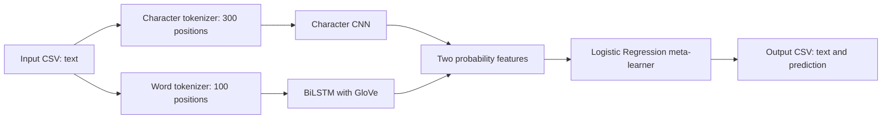

# Sarcasm Detection in News Headlines

A machine learning project that classifies short news headlines as sarcastic or non-sarcastic. It combines word-level and character-level neural networks through a Logistic Regression stacking model, with a TF-IDF baseline for comparison.

**Portfolio author:** Sirui Peng\
**Academic context:** Rutgers University, CS461 — Fall 2025\
**Dataset:** 23,146 labeled headlines across training, validation, and test splits\
**Verified saved-model performance:** **87.99% accuracy · 0.8731 F1** on the 966-row test split

[Technical report](CS461_Sarcasm_Detection_Report.md) · [Training notebook](SarcasmDetection.ipynb) · [Inference implementation](predict_sarcasm.py) · [Verification record](docs/verification-2026-10-04.json)

## Project overview

I implemented data exploration, text preprocessing, baseline and neural-network training, model evaluation, stacking, and a command-line inference workflow. The work covers:

- **Logistic Regression + TF-IDF:** a baseline using unigram and bigram features.
- **BiLSTM:** sequence modeling with randomly initialized word embeddings.
- **BiLSTM + GloVe:** initialization with pretrained 100-dimensional word vectors, followed by task-specific training with trainable embeddings.
- **Character-level CNN:** convolutional features over character sequences.
- **Stacking:** a Logistic Regression meta-learner combining the two neural models' predicted probabilities.
- **Reusable inference:** saved weights, tokenizers, and configuration loaded by a CSV-to-CSV prediction script.

## Verified results

The existing saved models were run through `predict_sarcasm.py` on all 966 rows of `test.csv` on **October 4, 2026**. Metrics were recomputed from the resulting predictions and the supplied labels.

| Metric | Result |
|---|---:|
| Accuracy | **87.99%** |
| Precision — sarcastic class | 0.8418 |
| Recall — sarcastic class | 0.9068 |
| F1 — sarcastic class | **0.8731** |
| Correct predictions | 850 / 966 |

The output matched the repository's `predictions.csv`. The [verification record](docs/verification-2026-10-04.json) identifies the runtime versions, artifact hashes, and confusion matrix. The [report](CS461_Sarcasm_Detection_Report.md) also explains the historical experiment results and the supplied data splits.

## Inference pipeline



`prediction = 1` denotes sarcasm; `prediction = 0` denotes non-sarcasm.

## Run the saved model

The inference workflow was verified with **Python 3.11.9**, **TensorFlow 2.20.0**, **Keras 3.12.0**, and **scikit-learn 1.8.0**. `requirements.txt` records the dependency versions used for this verification.

```bash
git clone https://github.com/SiruipThree/CS461_FinalProject.git
cd CS461_FinalProject
python3.11 -m venv .venv
source .venv/bin/activate
python -m pip install -r requirements.txt
python predict_sarcasm.py --input test.csv --output /tmp/sarcasm_predictions.csv
```

An input CSV must contain a `text` column. A label column is only needed to evaluate predictions. The output contains `text` and `prediction` columns in the input row order. The script fills missing text with an empty string before tokenization.

The saved models include the learned embedding weights, so inference can run locally after dependencies and the repository have been downloaded. GloVe is required separately for retraining.

## Training and evaluation

The [notebook](SarcasmDetection.ipynb) contains the development experiments: data inspection, the TF-IDF baseline, a basic BiLSTM, the GloVe model, the character CNN, and stacking. To explore or retrain them:

1. Install the recorded dependencies and a notebook interface, such as `jupyterlab`.
2. Obtain `glove.6B.100d.txt` from the [Stanford GloVe project](https://nlp.stanford.edu/projects/glove/) and place it in the repository root.
3. Open `SarcasmDetection.ipynb` and inspect its training sections in order.

The base neural models use validation loss for early stopping. The stacker is trained on their validation-set probability outputs. The notebook preserves earlier experiment outputs; full retraining can produce a different checkpoint and different metrics. The saved-model command above is the verified reproduction path for the results highlighted here.

## Repository guide

| File or directory | Purpose |
|---|---|
| `CS461_Sarcasm_Detection_Report.md` | Model design, training procedure, results, and limitations |
| `SarcasmDetection.ipynb` | Main development notebook and stored experiment outputs |
| `predict_sarcasm.py` | Saved-model loading, preprocessing, and CSV predictions |
| `models/` | Neural weights, tokenizers, stacker, and configuration |
| `train.csv`, `valid.csv`, `test.csv` | Supplied course data splits |
| `predictions.csv` | Predictions matching the verified saved-model run |
| `docs/verification-2026-10-04.json` | Saved-model verification evidence |
| `SarcasmDetection(abandon).ipynb`, `test_predictions.csv` | Earlier development artifacts |
| `cs_461_final_project.pdf` | Original course assignment specification |

This is an academic NLP project. Evaluation describes the supplied course data; data-quality observations and directions for stronger validation are documented in the report. The original notebook retains the course-era team credits.
